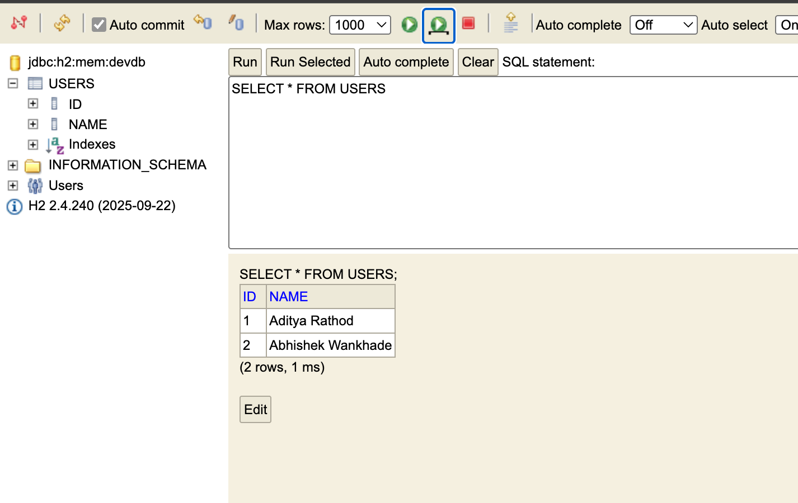

arathod@C19698 spBoot % docker exec -it postgres-db psql -U admin -d mydatabase
psql (16.13 (Debian 16.13-1.pgdg13+1))
Type "help" for help.

mydatabase=# \dt
List of relations
Schema | Name  | Type  | Owner
--------+-------+-------+-------
public | users | table | admin
(1 row)

mydatabase=# select * from users
mydatabase-# ;
id |       name        
----+-------------------
1 | ADITYA RATHOD
2 | ABHISHEK WANKHADE
(2 rows)

mydatabase=# 

---
# Local Profile with H2
